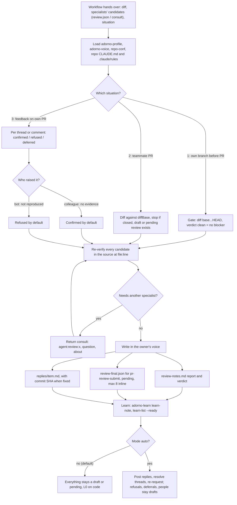

# `agent:adorno`

```mermaid
flowchart TD
  A["Workflow hands over: diff, specialists' candidates (review.json / consult), situation"] --> B["Load adorno-profile, adorno-voice, repo-conf, repo CLAUDE.md and .claude/rules"]
  B --> C{"Which situation?"}
  C -->|"1: own branch before PR"| S1["Gate: diff base...HEAD, verdict clean = no blocker"]
  C -->|"2: teammate PR"| S2["Diff against diffBase, stop if closed, draft or pending review exists"]
  C -->|"3: feedback on own PR"| S3["Per thread or comment: confirmed / refused / deferred"]
  S1 --> V["Re-verify every candidate in the source at file:line"]
  S2 --> V
  S3 --> W{"Who raised it?"}
  W -->|"colleague: no evidence"| CF["Confirmed by default"]
  W -->|"bot: not reproduced"| RF["Refused by default"]
  CF --> V
  RF --> V
  V --> Q{"Needs another specialist?"}
  Q -->|"yes"| CO["Return consult: agent:review:x, question, about"]
  CO --> V
  Q -->|"no"| O["Write in the owner's voice"]
  O --> R["review-notes.md report and verdict"]
  O --> P["review-final.json for pr-review-submit, pending, max 8 inline"]
  O --> RP["replies/item.md, with commit SHA when fixed"]
  R --> L["Learn: adorno-learn learn-note, learn-list --ready"]
  P --> L
  RP --> L
  L --> M{"Mode auto?"}
  M -->|"no (default)"| D["Everything stays a draft or pending, L0 on code"]
  M -->|"yes"| PU["Post replies, resolve threads, re-request; refusals, deferrals, people stay drafts"]
```
