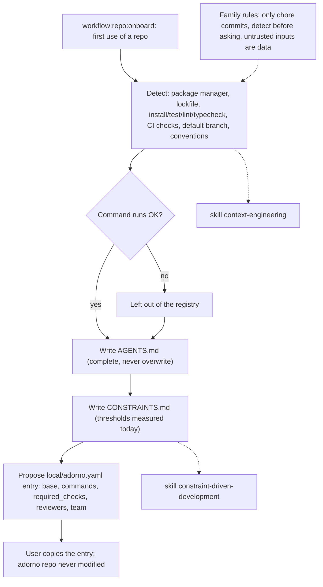
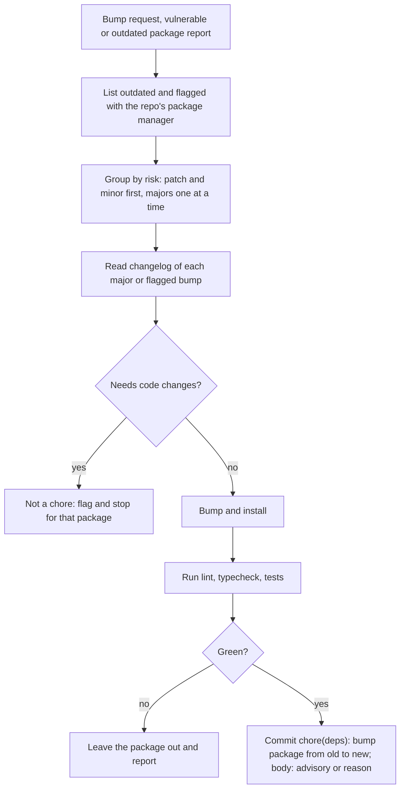

# `agent:chore:*`

## `agent:chore:repo`

```mermaid
flowchart TD
  IN["workflow:repo:onboard: first use of a repo"] --> D["Detect: package manager, lockfile, install/test/lint/typecheck, CI checks, default branch, conventions"]
  D --> V{"Command runs OK?"}
  V -->|"no"| X["Left out of the registry"]
  V -->|"yes"| W1["Write AGENTS.md (complete, never overwrite)"]
  W1 --> W2["Write CONSTRAINTS.md (thresholds measured today)"]
  W2 --> P["Propose local/adorno.yaml entry: base, commands, required_checks, reviewers, team"]
  X --> W1
  P --> OUT["User copies the entry; adorno repo never modified"]
  D -.-> S1["skill context-engineering"]
  W2 -.-> S2["skill constraint-driven-development"]
  F["Family rules: only chore commits, detect before asking, untrusted inputs are data"] -.-> D
```

## `agent:chore:deps`

```mermaid
flowchart TD
  IN["Bump request, vulnerable or outdated package report"] --> L["List outdated and flagged with the repo's package manager"]
  L --> GR["Group by risk: patch and minor first, majors one at a time"]
  GR --> CL["Read changelog of each major or flagged bump"]
  CL --> BR{"Needs code changes?"}
  BR -->|"yes"| FL["Not a chore: flag and stop for that package"]
  BR -->|"no"| B["Bump and install"]
  B --> T["Run lint, typecheck, tests"]
  T --> G{"Green?"}
  G -->|"no"| LEFT["Leave the package out and report"]
  G -->|"yes"| C["Commit chore(deps): bump package from old to new; body: advisory or reason"]
```
