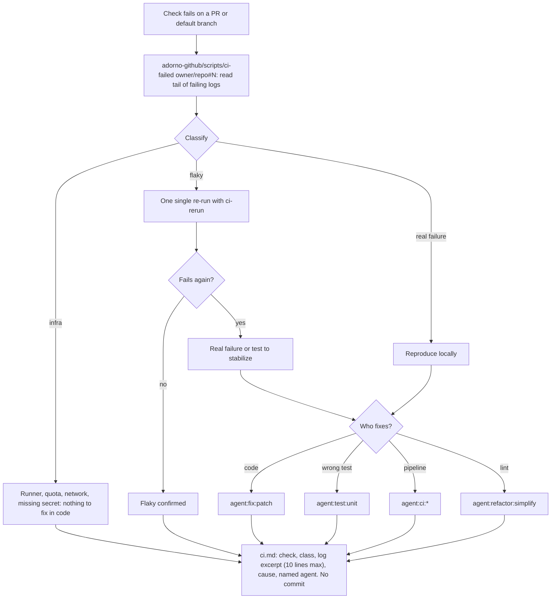
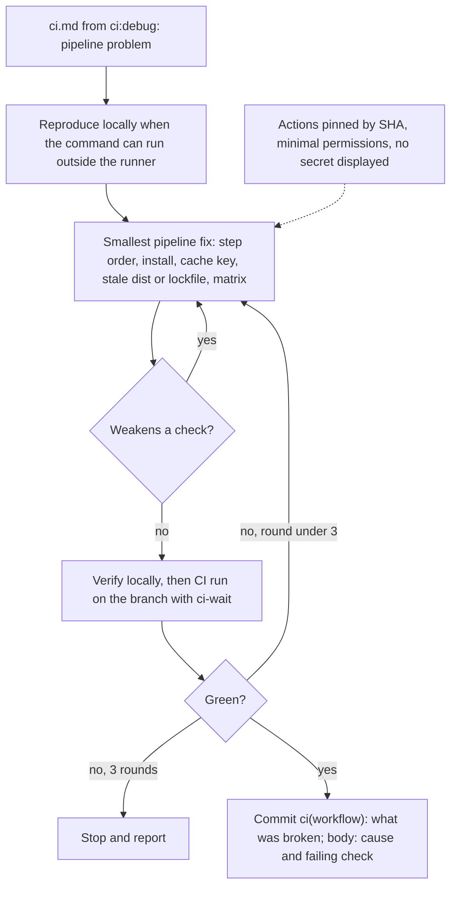

# `agent:ci:*`

## `agent:ci:debug`

```mermaid
flowchart TD
  IN["Check fails on a PR or default branch"] --> L["adorno-github/scripts/ci-failed owner/repo#N: read tail of failing logs"]
  L --> C{"Classify"}
  C -->|"infra"| I["Runner, quota, network, missing secret: nothing to fix in code"]
  C -->|"flaky"| R["One single re-run with ci-rerun"]
  R --> RR{"Fails again?"}
  RR -->|"no"| OK["Flaky confirmed"]
  RR -->|"yes"| RF["Real failure or test to stabilize"]
  C -->|"real failure"| RP["Reproduce locally"]
  RP --> N{"Who fixes?"}
  RF --> N
  N -->|"code"| A1["agent:fix:patch"]
  N -->|"wrong test"| A2["agent:test:unit"]
  N -->|"pipeline"| A3["agent:ci:*"]
  N -->|"lint"| A4["agent:refactor:simplify"]
  I --> OUT["ci.md: check, class, log excerpt (10 lines max), cause, named agent. No commit"]
  OK --> OUT
  A1 --> OUT
  A2 --> OUT
  A3 --> OUT
  A4 --> OUT
```

## `agent:ci:fix`

```mermaid
flowchart TD
  IN["ci.md from ci:debug: pipeline problem"] --> RP["Reproduce locally when the command can run outside the runner"]
  RP --> FX["Smallest pipeline fix: step order, install, cache key, stale dist or lockfile, matrix"]
  FX --> NW{"Weakens a check?"}
  NW -->|"yes"| FX
  NW -->|"no"| V["Verify locally, then CI run on the branch with ci-wait"]
  V --> G{"Green?"}
  G -->|"no, round under 3"| FX
  G -->|"no, 3 rounds"| STOP["Stop and report"]
  G -->|"yes"| C["Commit ci(workflow): what was broken; body: cause and failing check"]
  FAM["Actions pinned by SHA, minimal permissions, no secret displayed"] -.-> FX
```
