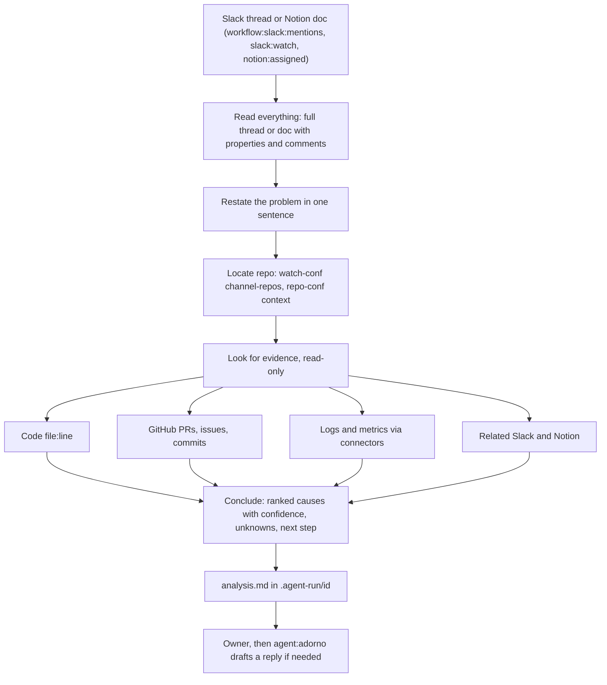
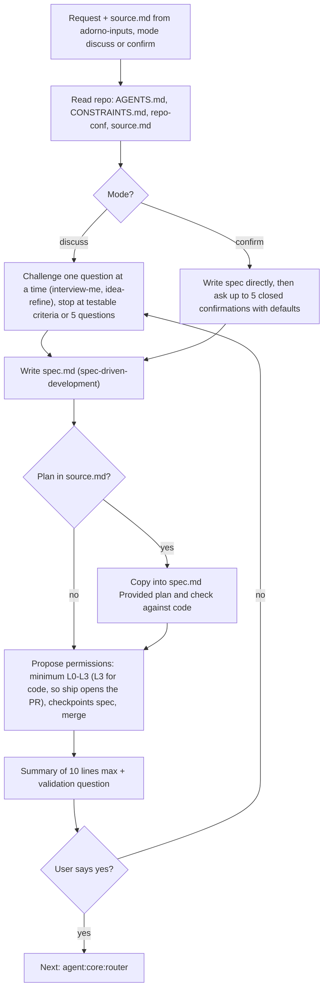
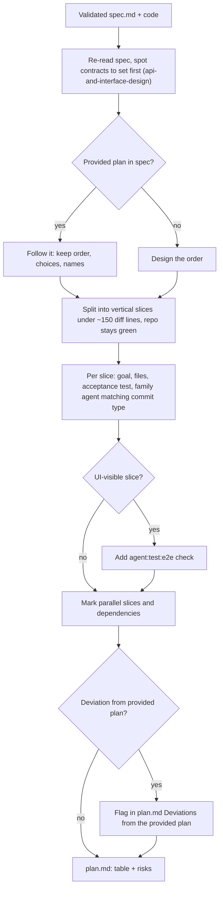
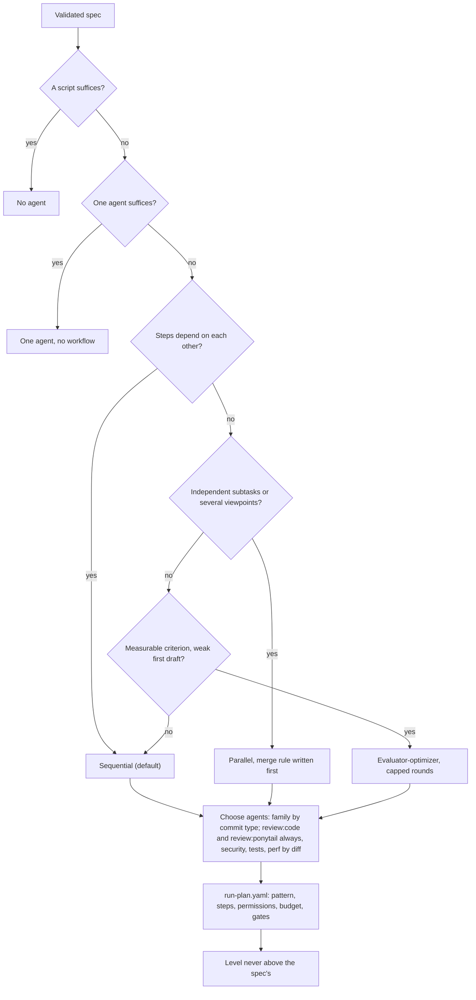
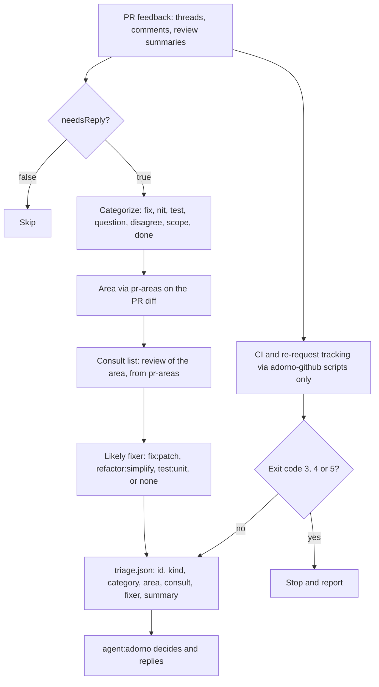

# `agent:core:*`

## `agent:core:analyst`

```mermaid
flowchart TD
  A["Slack thread or Notion doc (workflow:slack:mentions, slack:watch, notion:assigned)"] --> B["Read everything: full thread or doc with properties and comments"]
  B --> C["Restate the problem in one sentence"]
  C --> D["Locate repo: watch-conf channel-repos, repo-conf context"]
  D --> E["Look for evidence, read-only"]
  E --> E1["Code file:line"]
  E --> E2["GitHub PRs, issues, commits"]
  E --> E3["Logs and metrics via connectors"]
  E --> E4["Related Slack and Notion"]
  E1 --> F["Conclude: ranked causes with confidence, unknowns, next step"]
  E2 --> F
  E3 --> F
  E4 --> F
  F --> G["analysis.md in .agent-run/id"]
  G --> H["Owner, then agent:adorno drafts a reply if needed"]
```

## `agent:core:intake`

```mermaid
flowchart TD
  A["Request + source.md from adorno-inputs, mode discuss or confirm"] --> B["Read repo: AGENTS.md, CONSTRAINTS.md, repo-conf, source.md"]
  B --> C{"Mode?"}
  C -->|"discuss"| D["Challenge one question at a time (interview-me, idea-refine), stop at testable criteria or 5 questions"]
  C -->|"confirm"| E["Write spec directly, then ask up to 5 closed confirmations with defaults"]
  D --> F["Write spec.md (spec-driven-development)"]
  E --> F
  F --> G{"Plan in source.md?"}
  G -->|"yes"| H["Copy into spec.md Provided plan and check against code"]
  G -->|"no"| I["Propose permissions: minimum L0-L3 (L3 for code, so ship opens the PR), checkpoints spec, merge"]
  H --> I
  I --> J["Summary of 10 lines max + validation question"]
  J --> K{"User says yes?"}
  K -->|"yes"| L["Next: agent:core:router"]
  K -->|"no"| D
```

## `agent:core:planner`

```mermaid
flowchart TD
  A["Validated spec.md + code"] --> B["Re-read spec, spot contracts to set first (api-and-interface-design)"]
  B --> C{"Provided plan in spec?"}
  C -->|"yes"| D["Follow it: keep order, choices, names"]
  C -->|"no"| E["Design the order"]
  D --> F["Split into vertical slices under ~150 diff lines, repo stays green"]
  E --> F
  F --> G["Per slice: goal, files, acceptance test, family agent matching commit type"]
  G --> H{"UI-visible slice?"}
  H -->|"yes"| I["Add agent:test:e2e check"]
  H -->|"no"| J["Mark parallel slices and dependencies"]
  I --> J
  J --> K{"Deviation from provided plan?"}
  K -->|"yes"| L["Flag in plan.md Deviations from the provided plan"]
  K -->|"no"| M["plan.md: table + risks"]
  L --> M
```

## `agent:core:router`

```mermaid
flowchart TD
  A["Validated spec"] --> B{"A script suffices?"}
  B -->|"yes"| N["No agent"]
  B -->|"no"| C{"One agent suffices?"}
  C -->|"yes"| O["One agent, no workflow"]
  C -->|"no"| D{"Steps depend on each other?"}
  D -->|"yes"| P["Sequential (default)"]
  D -->|"no"| E{"Independent subtasks or several viewpoints?"}
  E -->|"yes"| Q["Parallel, merge rule written first"]
  E -->|"no"| F{"Measurable criterion, weak first draft?"}
  F -->|"yes"| R["Evaluator-optimizer, capped rounds"]
  F -->|"no"| P
  P --> G["Choose agents: family by commit type; review:code and review:ponytail always, security, tests, perf by diff"]
  Q --> G
  R --> G
  G --> H["run-plan.yaml: pattern, steps, permissions, budget, gates"]
  H --> I["Level never above the spec's"]
```

## `agent:core:triage`

```mermaid
flowchart TD
  A["PR feedback: threads, comments, review summaries"] --> B{"needsReply?"}
  B -->|"false"| X["Skip"]
  B -->|"true"| C["Categorize: fix, nit, test, question, disagree, scope, done"]
  C --> D["Area via pr-areas on the PR diff"]
  D --> E["Consult list: review of the area, from pr-areas"]
  E --> F["Likely fixer: fix:patch, refactor:simplify, test:unit, or none"]
  F --> G["triage.json: id, kind, category, area, consult, fixer, summary"]
  G --> H["agent:adorno decides and replies"]
  A --> I["CI and re-request tracking via adorno-github scripts only"]
  I --> J{"Exit code 3, 4 or 5?"}
  J -->|"yes"| K["Stop and report"]
  J -->|"no"| G
```
