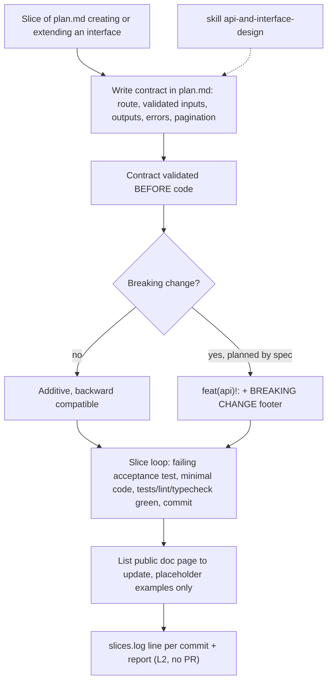
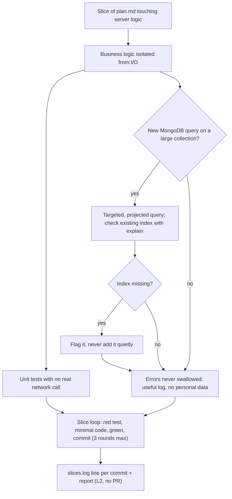
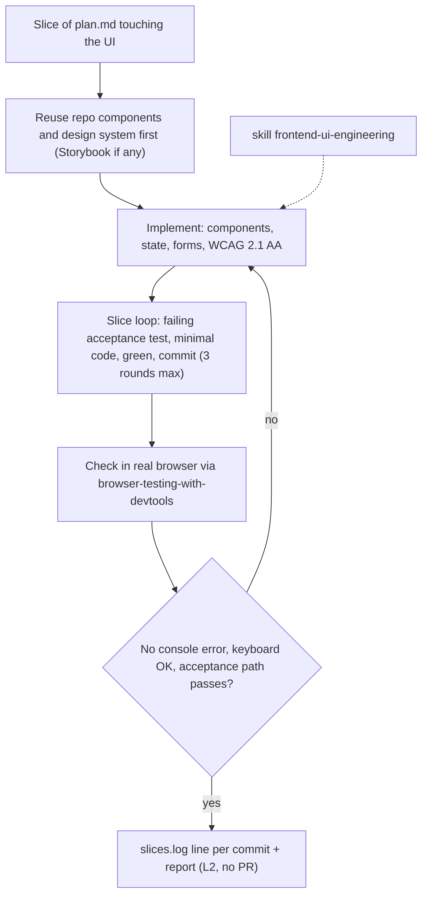

# `agent:feat:*`

## `agent:feat:api`

```mermaid
flowchart TD
  IN["Slice of plan.md creating or extending an interface"] --> K["Write contract in plan.md: route, validated inputs, outputs, errors, pagination"]
  K --> V["Contract validated BEFORE code"]
  V --> B{"Breaking change?"}
  B -->|"no"| A["Additive, backward compatible"]
  B -->|"yes, planned by spec"| BR["feat(api)!: + BREAKING CHANGE footer"]
  A --> L["Slice loop: failing acceptance test, minimal code, tests/lint/typecheck green, commit"]
  BR --> L
  L --> D["List public doc page to update, placeholder examples only"]
  D --> OUT["slices.log line per commit + report (L2, no PR)"]
  S["skill api-and-interface-design"] -.-> K
```

## `agent:feat:back`

```mermaid
flowchart TD
  IN["Slice of plan.md touching server logic"] --> BL["Business logic isolated from I/O"]
  BL --> T["Unit tests with no real network call"]
  BL --> M{"New MongoDB query on a large collection?"}
  M -->|"yes"| E["Targeted, projected query; check existing index with explain"]
  E --> IX{"Index missing?"}
  IX -->|"yes"| FL["Flag it, never add it quietly"]
  IX -->|"no"| ER
  M -->|"no"| ER["Errors never swallowed: useful log, no personal data"]
  FL --> ER
  T --> L["Slice loop: red test, minimal code, green, commit (3 rounds max)"]
  ER --> L
  L --> OUT["slices.log line per commit + report (L2, no PR)"]
```

## `agent:feat:front`

```mermaid
flowchart TD
  IN["Slice of plan.md touching the UI"] --> R["Reuse repo components and design system first (Storybook if any)"]
  R --> I["Implement: components, state, forms, WCAG 2.1 AA"]
  I --> L["Slice loop: failing acceptance test, minimal code, green, commit (3 rounds max)"]
  L --> CHK["Check in real browser via browser-testing-with-devtools"]
  CHK --> Q{"No console error, keyboard OK, acceptance path passes?"}
  Q -->|"no"| I
  Q -->|"yes"| OUT["slices.log line per commit + report (L2, no PR)"]
  S["skill frontend-ui-engineering"] -.-> I
```
