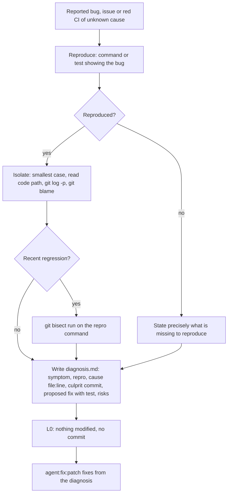
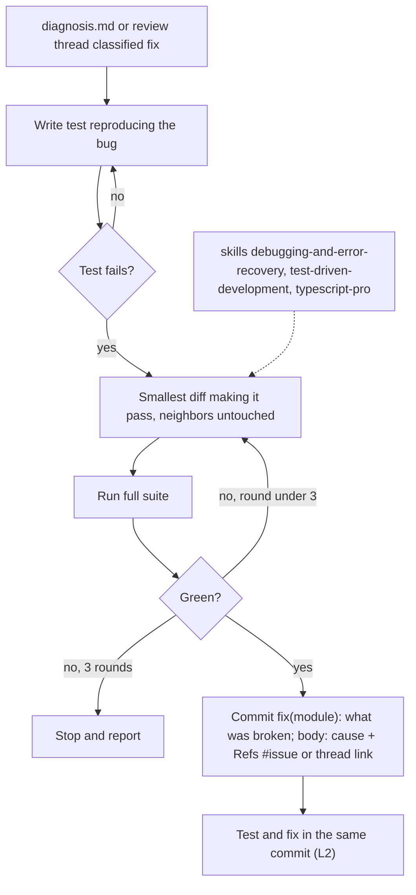

# `agent:fix:*`

## `agent:fix:investigate`

```mermaid
flowchart TD
  IN["Reported bug, issue or red CI of unknown cause"] --> R["Reproduce: command or test showing the bug"]
  R --> RQ{"Reproduced?"}
  RQ -->|"no"| MISS["State precisely what is missing to reproduce"]
  RQ -->|"yes"| ISO["Isolate: smallest case, read code path, git log -p, git blame"]
  ISO --> REG{"Recent regression?"}
  REG -->|"yes"| BIS["git bisect run on the repro command"]
  REG -->|"no"| DG
  BIS --> DG["Write diagnosis.md: symptom, repro, cause file:line, culprit commit, proposed fix with test, risks"]
  MISS --> DG
  DG --> OUT["L0: nothing modified, no commit"]
  OUT --> NEXT["agent:fix:patch fixes from the diagnosis"]
```

## `agent:fix:patch`

```mermaid
flowchart TD
  IN["diagnosis.md or review thread classified fix"] --> T["Write test reproducing the bug"]
  T --> F{"Test fails?"}
  F -->|"no"| T
  F -->|"yes"| FX["Smallest diff making it pass, neighbors untouched"]
  FX --> S["Run full suite"]
  S --> G{"Green?"}
  G -->|"no, round under 3"| FX
  G -->|"no, 3 rounds"| STOP["Stop and report"]
  G -->|"yes"| C["Commit fix(module): what was broken; body: cause + Refs #issue or thread link"]
  C --> OUT["Test and fix in the same commit (L2)"]
  SK["skills debugging-and-error-recovery, test-driven-development, typescript-pro"] -.-> FX
```
