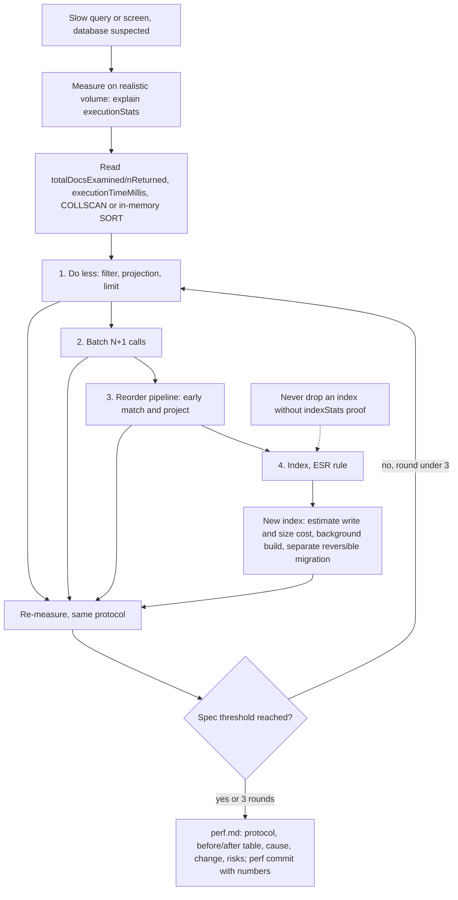
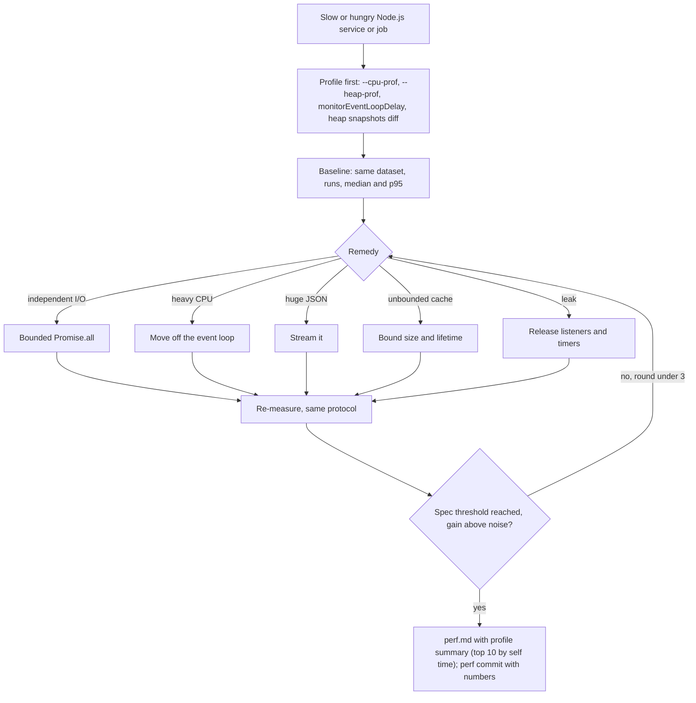

# `agent:perf:*`

## `agent:perf:mongodb`

```mermaid
flowchart TD
  IN["Slow query or screen, database suspected"] --> M["Measure on realistic volume: explain executionStats"]
  M --> RD["Read totalDocsExamined/nReturned, executionTimeMillis, COLLSCAN or in-memory SORT"]
  RD --> R1["1. Do less: filter, projection, limit"]
  R1 --> R2["2. Batch N+1 calls"]
  R2 --> R3["3. Reorder pipeline: early match and project"]
  R3 --> R4["4. Index, ESR rule"]
  R4 --> IDX["New index: estimate write and size cost, background build, separate reversible migration"]
  R1 --> RM["Re-measure, same protocol"]
  R2 --> RM
  R3 --> RM
  IDX --> RM
  RM --> TH{"Spec threshold reached?"}
  TH -->|"no, round under 3"| R1
  TH -->|"yes or 3 rounds"| OUT["perf.md: protocol, before/after table, cause, change, risks; perf commit with numbers"]
  NOTE["Never drop an index without indexStats proof"] -.-> R4
```

## `agent:perf:nodejs`

```mermaid
flowchart TD
  IN["Slow or hungry Node.js service or job"] --> P["Profile first: --cpu-prof, --heap-prof, monitorEventLoopDelay, heap snapshots diff"]
  P --> BASE["Baseline: same dataset, runs, median and p95"]
  BASE --> RM{"Remedy"}
  RM -->|"independent I/O"| A["Bounded Promise.all"]
  RM -->|"heavy CPU"| B["Move off the event loop"]
  RM -->|"huge JSON"| C["Stream it"]
  RM -->|"unbounded cache"| D["Bound size and lifetime"]
  RM -->|"leak"| E["Release listeners and timers"]
  A --> AF["Re-measure, same protocol"]
  B --> AF
  C --> AF
  D --> AF
  E --> AF
  AF --> TH{"Spec threshold reached, gain above noise?"}
  TH -->|"no, round under 3"| RM
  TH -->|"yes"| OUT["perf.md with profile summary (top 10 by self time); perf commit with numbers"]
```
