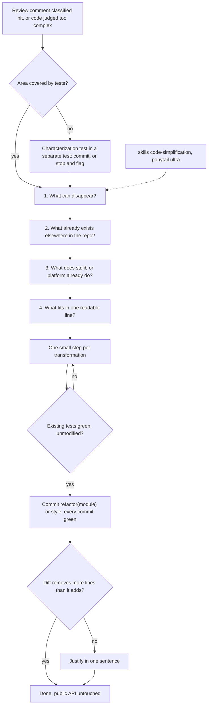
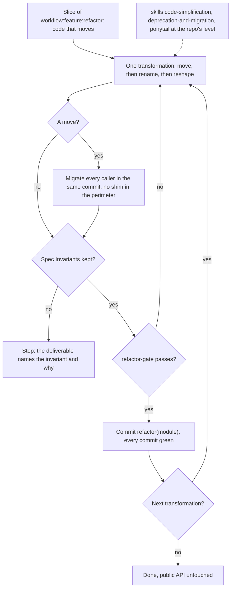

# `agent:refactor:*`

## `agent:refactor:simplify`

```mermaid
flowchart TD
  IN["Review comment classified nit, or code judged too complex"] --> TS{"Area covered by tests?"}
  TS -->|"no"| CT["Characterization test in a separate test: commit, or stop and flag"]
  TS -->|"yes"| S1
  CT --> S1["1. What can disappear?"]
  S1 --> S2["2. What already exists elsewhere in the repo?"]
  S2 --> S3["3. What does stdlib or platform already do?"]
  S3 --> S4["4. What fits in one readable line?"]
  S4 --> ST["One small step per transformation"]
  ST --> G{"Existing tests green, unmodified?"}
  G -->|"no"| ST
  G -->|"yes"| CM["Commit refactor(module) or style, every commit green"]
  CM --> DF{"Diff removes more lines than it adds?"}
  DF -->|"no"| J["Justify in one sentence"]
  DF -->|"yes"| OUT["Done, public API untouched"]
  J --> OUT
  SK["skills code-simplification, ponytail ultra"] -.-> S1
```

## `agent:refactor:structure`

```mermaid
flowchart TD
  IN["Slice of workflow:feature:refactor: code that moves"] --> TR["One transformation: move, then rename, then reshape"]
  TR --> MV{"A move?"}
  MV -->|"yes"| CL["Migrate every caller in the same commit, no shim in the perimeter"]
  MV -->|"no"| IV
  CL --> IV{"Spec Invariants kept?"}
  IV -->|"no"| SP["Stop: the deliverable names the invariant and why"]
  IV -->|"yes"| G{"refactor-gate passes?"}
  G -->|"no"| TR
  G -->|"yes"| CM["Commit refactor(module), every commit green"]
  CM --> NX{"Next transformation?"}
  NX -->|"yes"| TR
  NX -->|"no"| OUT["Done, public API untouched"]
  SK["skills code-simplification, deprecation-and-migration, ponytail at the repo's level"] -.-> TR
```
