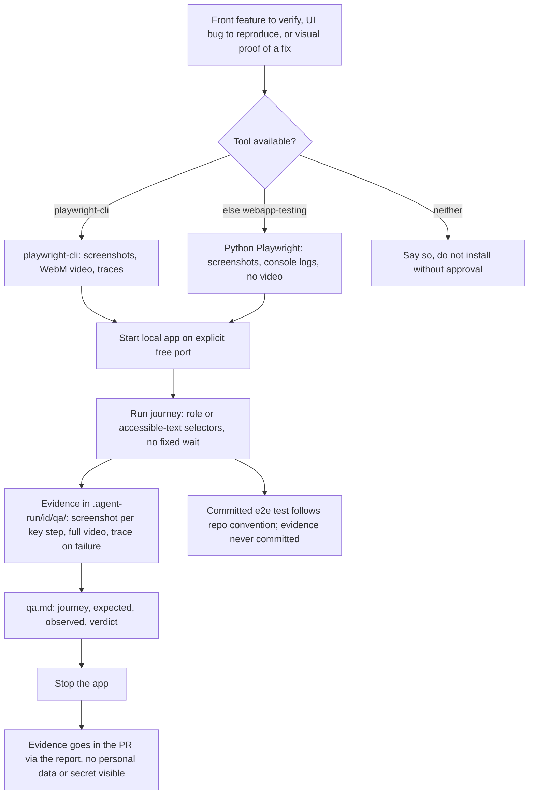
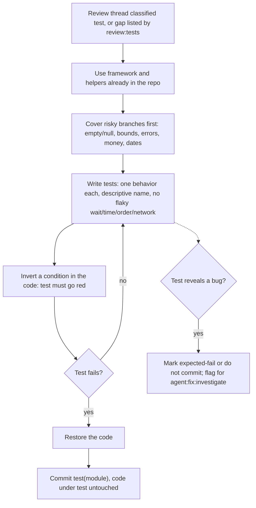

# `agent:test:*`

## `agent:test:e2e`

```mermaid
flowchart TD
  IN["Front feature to verify, UI bug to reproduce, or visual proof of a fix"] --> TL{"Tool available?"}
  TL -->|"playwright-cli"| T1["playwright-cli: screenshots, WebM video, traces"]
  TL -->|"else webapp-testing"| T2["Python Playwright: screenshots, console logs, no video"]
  TL -->|"neither"| SAY["Say so, do not install without approval"]
  T1 --> APP["Start local app on explicit free port"]
  T2 --> APP
  APP --> RUN["Run journey: role or accessible-text selectors, no fixed wait"]
  RUN --> EV["Evidence in .agent-run/id/qa/: screenshot per key step, full video, trace on failure"]
  EV --> QA["qa.md: journey, expected, observed, verdict"]
  QA --> STOP["Stop the app"]
  STOP --> PR["Evidence goes in the PR via the report, no personal data or secret visible"]
  RUN --> CM["Committed e2e test follows repo convention; evidence never committed"]
```

## `agent:test:unit`

```mermaid
flowchart TD
  IN["Review thread classified test, or gap listed by review:tests"] --> FW["Use framework and helpers already in the repo"]
  FW --> RISK["Cover risky branches first: empty/null, bounds, errors, money, dates"]
  RISK --> W["Write tests: one behavior each, descriptive name, no flaky wait/time/order/network"]
  W --> MUT["Invert a condition in the code: test must go red"]
  MUT --> RES{"Test fails?"}
  RES -->|"no"| W
  RES -->|"yes"| RST["Restore the code"]
  RST --> CM["Commit test(module), code under test untouched"]
  W -.-> BUG{"Test reveals a bug?"}
  BUG -->|"yes"| XF["Mark expected-fail or do not commit; flag for agent:fix:investigate"]
```
