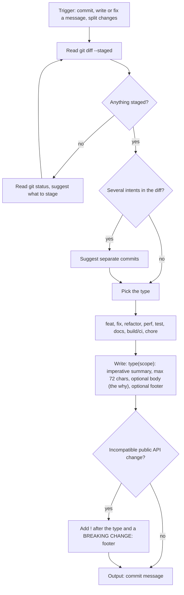

# `adorno-commit`

```mermaid
flowchart TD
  T["Trigger: commit, write or fix a message, split changes"] --> R["Read git diff --staged"]
  R --> E{"Anything staged?"}
  E -->|"no"| S["Read git status, suggest what to stage"]
  S --> R
  E -->|"yes"| M{"Several intents in the diff?"}
  M -->|"yes"| SP["Suggest separate commits"]
  M -->|"no"| TY["Pick the type"]
  SP --> TY
  TY --> TT["feat, fix, refactor, perf, test, docs, build/ci, chore"]
  TT --> MSG["Write: type(scope): imperative summary, max 72 chars, optional body (the why), optional footer"]
  MSG --> B{"Incompatible public API change?"}
  B -->|"yes"| BC["Add ! after the type and a BREAKING CHANGE: footer"]
  B -->|"no"| O["Output: commit message"]
  BC --> O
```
