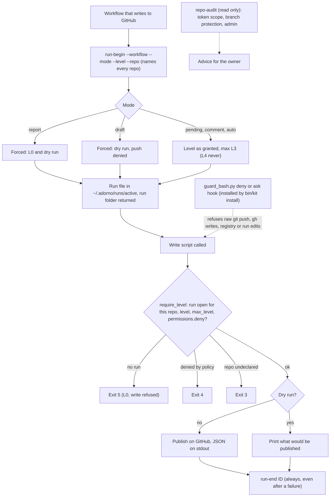
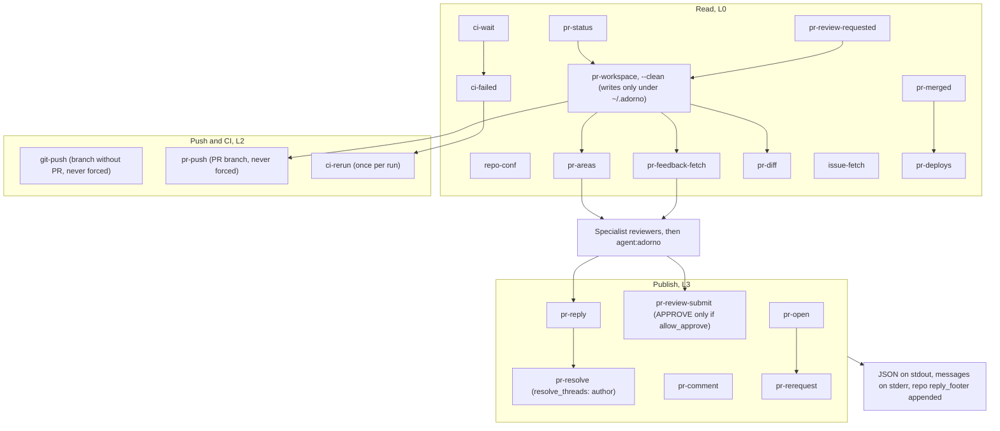

# `adorno-github`

## Runs, levels and guards

```mermaid
flowchart TD
  W["Workflow that writes to GitHub"] --> RB["run-begin --workflow --mode --level --repo (names every repo)"]
  RB --> MD{"Mode"}
  MD -->|"report"| F1["Forced: L0 and dry run"]
  MD -->|"draft"| F2["Forced: dry run, push denied"]
  MD -->|"pending, comment, auto"| F3["Level as granted, max L3 (L4 never)"]
  F1 --> RF["Run file in ~/.adorno/runs/active, run folder returned"]
  F2 --> RF
  F3 --> RF
  RF --> WS["Write script called"]
  WS --> CK{"require_level: run open for this repo, level, max_level, permissions.deny?"}
  CK -->|"no run"| X5["Exit 5 (L0, write refused)"]
  CK -->|"denied by policy"| X4["Exit 4"]
  CK -->|"repo undeclared"| X3["Exit 3"]
  CK -->|"ok"| DR{"Dry run?"}
  DR -->|"yes"| PR["Print what would be published"]
  DR -->|"no"| GH["Publish on GitHub, JSON on stdout"]
  GH --> RE["run-end ID (always, even after a failure)"]
  PR --> RE
  GD["guard_bash.py deny or ask hook (installed by bin/kit install)"] -.->|"refuses raw git push, gh writes, registry or run edits"| WS
  RA["repo-audit (read only): token scope, branch protection, admin"] -.-> OUTA["Advice for the owner"]
```

## Scripts by level

```mermaid
flowchart TD
  subgraph L0["Read, L0"]
    RC["repo-conf"]
    PS["pr-status"]
    PRR["pr-review-requested"]
    PFF["pr-feedback-fetch"]
    PW["pr-workspace, --clean (writes only under ~/.adorno)"]
    PA["pr-areas"]
    PD["pr-diff"]
    IF["issue-fetch"]
    PM["pr-merged"]
    PDP["pr-deploys"]
    CW["ci-wait"]
    CF["ci-failed"]
  end
  subgraph L2["Push and CI, L2"]
    GP["git-push (branch without PR, never forced)"]
    PP["pr-push (PR branch, never forced)"]
    CR["ci-rerun (once per run)"]
  end
  subgraph L3["Publish, L3"]
    PRP["pr-reply"]
    PRS["pr-resolve (resolve_threads: author)"]
    PC["pr-comment"]
    PRV["pr-review-submit (APPROVE only if allow_approve)"]
    PRQ["pr-rerequest"]
    PO["pr-open"]
  end
  PS --> PW
  PRR --> PW
  PW --> PA
  PW --> PD
  PW --> PFF
  PA --> RV["Specialist reviewers, then agent:adorno"]
  PFF --> RV
  RV --> PRP
  RV --> PRV
  PRP --> PRS
  PW --> PP
  CF --> CR
  CW --> CF
  PO --> PRQ
  PM --> PDP
  L3 --> OUT["JSON on stdout, messages on stderr, repo reply_footer appended"]
```
