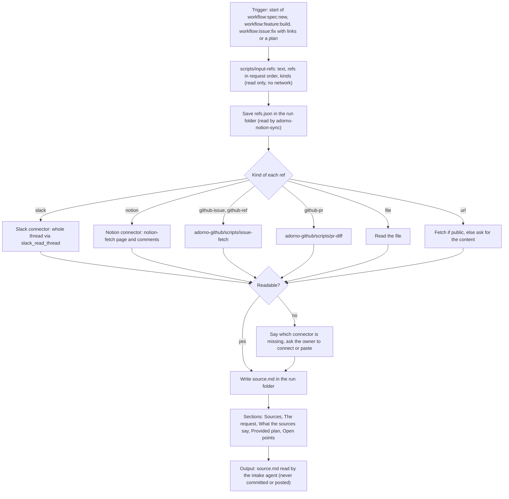

# `adorno-inputs`

```mermaid
flowchart TD
  T["Trigger: start of workflow:spec:new, workflow:feature:build, workflow:issue:fix with links or a plan"] --> IR["scripts/input-refs: text, refs in request order, kinds (read only, no network)"]
  IR --> RJ["Save refs.json in the run folder (read by adorno-notion-sync)"]
  RJ --> K{"Kind of each ref"}
  K -->|"slack"| SL["Slack connector: whole thread via slack_read_thread"]
  K -->|"notion"| NO["Notion connector: notion-fetch page and comments"]
  K -->|"github-issue, github-ref"| GI["adorno-github/scripts/issue-fetch"]
  K -->|"github-pr"| GP["adorno-github/scripts/pr-diff"]
  K -->|"file"| FI["Read the file"]
  K -->|"url"| UR["Fetch if public, else ask for the content"]
  SL --> OK{"Readable?"}
  NO --> OK
  GI --> OK
  GP --> OK
  FI --> OK
  UR --> OK
  OK -->|"no"| MS["Say which connector is missing, ask the owner to connect or paste"]
  OK -->|"yes"| W["Write source.md in the run folder"]
  MS --> W
  W --> SEC["Sections: Sources, The request, What the sources say, Provided plan, Open points"]
  SEC --> OUT["Output: source.md read by the intake agent (never committed or posted)"]
```
