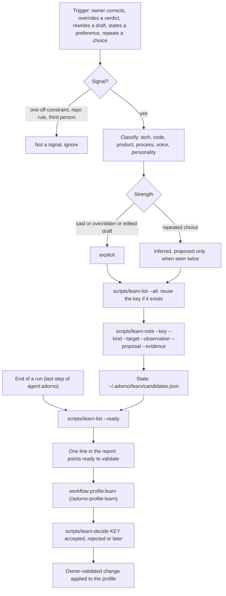

# `adorno-learn`

```mermaid
flowchart TD
  T["Trigger: owner corrects, overrides a verdict, rewrites a draft, states a preference, repeats a choice"] --> SG{"Signal?"}
  SG -->|"one-off constraint, repo rule, third person"| NO["Not a signal, ignore"]
  SG -->|"yes"| KD["Classify: tech, code, product, process, voice, personality"]
  KD --> ST{"Strength"}
  ST -->|"said or overridden or edited draft"| EX["explicit"]
  ST -->|"repeated choice"| IN["inferred, proposed only when seen twice"]
  EX --> LL["scripts/learn-list --all: reuse the key if it exists"]
  IN --> LL
  LL --> LN["scripts/learn-note --key --kind --target --observation --proposal --evidence"]
  LN --> STA["State: ~/.adorno/learn/candidates.json"]
  END1["End of a run (last step of agent:adorno)"] --> RD["scripts/learn-list --ready"]
  STA --> RD
  RD --> ONE["One line in the report: points ready to validate"]
  ONE --> WF["workflow:profile:learn (/adorno-profile-learn)"]
  WF --> LD["scripts/learn-decide KEY accepted, rejected or later"]
  LD --> PF["Owner-validated change applied to the profile"]
```
