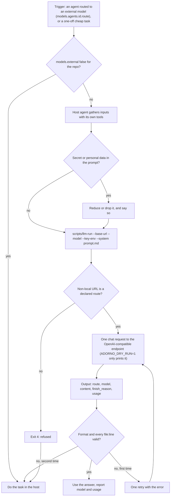

# `adorno-llm`

```mermaid
flowchart TD
  T["Trigger: an agent routed to an external model (models.agents.id.route), or a one-off cheap task"] --> EXT{"models.external false for the repo?"}
  EXT -->|"yes"| HOST["Do the task in the host"]
  EXT -->|"no"| GA["Host agent gathers inputs with its own tools"]
  GA --> SC{"Secret or personal data in the prompt?"}
  SC -->|"yes"| RD["Reduce or drop it, and say so"]
  SC -->|"no"| RUN
  RD --> RUN["scripts/llm-run --base-url --model --key-env --system prompt.md"]
  RUN --> RT{"Non-local URL is a declared route?"}
  RT -->|"no"| X4["Exit 4: refused"]
  RT -->|"yes"| API["One chat request to the OpenAI-compatible endpoint (ADORNO_DRY_RUN=1 only prints it)"]
  API --> JS["Output: route, model, content, finish_reason, usage"]
  JS --> CK{"Format and every file:line valid?"}
  CK -->|"yes"| USE["Use the answer, report model and usage"]
  CK -->|"no, first time"| RE["One retry with the error"]
  RE --> API
  CK -->|"no, second time"| HOST
  X4 --> HOST
```
