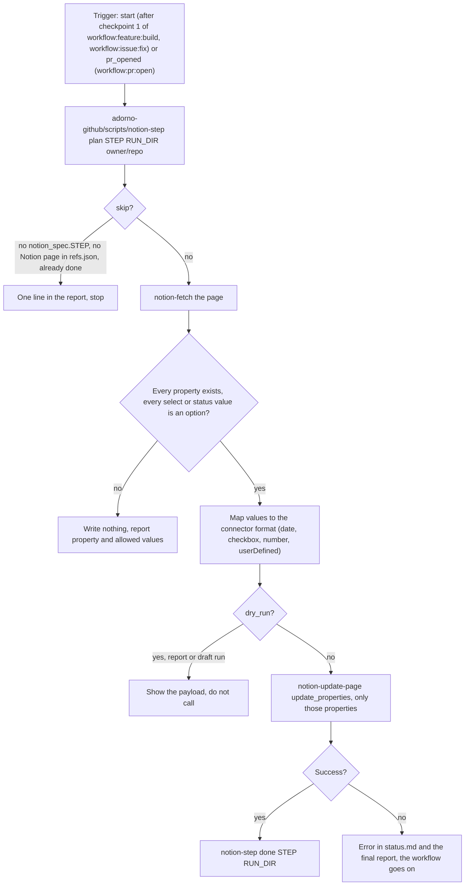

# `adorno-notion-sync`

```mermaid
flowchart TD
  T["Trigger: start (after checkpoint 1 of workflow:feature:build, workflow:issue:fix) or pr_opened (workflow:pr:open)"] --> P["adorno-github/scripts/notion-step plan STEP RUN_DIR owner/repo"]
  P --> SK{"skip?"}
  SK -->|"no notion_spec.STEP, no Notion page in refs.json, already done"| R1["One line in the report, stop"]
  SK -->|"no"| F["notion-fetch the page"]
  F --> CK{"Every property exists, every select or status value is an option?"}
  CK -->|"no"| R2["Write nothing, report property and allowed values"]
  CK -->|"yes"| MP["Map values to the connector format (date, checkbox, number, userDefined)"]
  MP --> DR{"dry_run?"}
  DR -->|"yes, report or draft run"| R3["Show the payload, do not call"]
  DR -->|"no"| U["notion-update-page update_properties, only those properties"]
  U --> OK{"Success?"}
  OK -->|"yes"| D["notion-step done STEP RUN_DIR"]
  OK -->|"no"| E["Error in status.md and the final report, the workflow goes on"]
```
