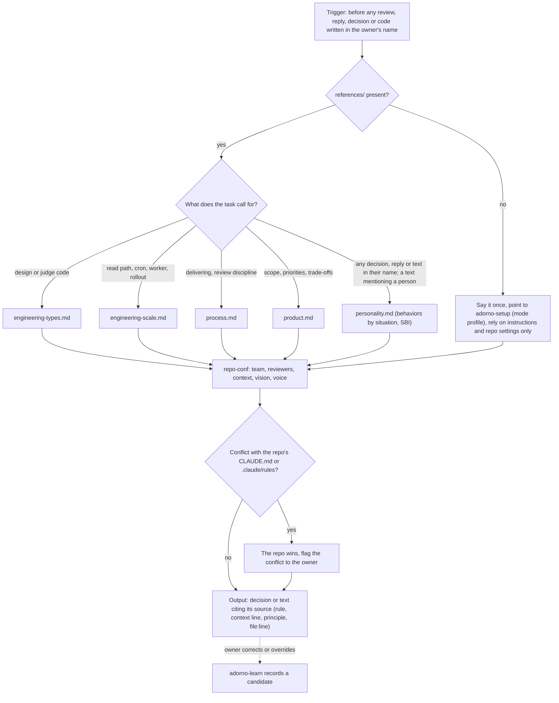

# `adorno-profile`

```mermaid
flowchart TD
  T["Trigger: before any review, reply, decision or code written in the owner's name"] --> RF{"references/ present?"}
  RF -->|"no"| NS["Say it once, point to adorno-setup (mode profile), rely on instructions and repo settings only"]
  RF -->|"yes"| TASK{"What does the task call for?"}
  TASK -->|"design or judge code"| F1["engineering-types.md"]
  TASK -->|"read path, cron, worker, rollout"| F2["engineering-scale.md"]
  TASK -->|"delivering, review discipline"| F3["process.md"]
  TASK -->|"scope, priorities, trade-offs"| F4["product.md"]
  TASK -->|"any decision, reply or text in their name; a text mentioning a person"| F5["personality.md (behaviors by situation, SBI)"]
  F1 --> RC["repo-conf: team, reviewers, context, vision, voice"]
  F2 --> RC
  F3 --> RC
  F4 --> RC
  F5 --> RC
  NS --> RC
  RC --> AU{"Conflict with the repo's CLAUDE.md or .claude/rules?"}
  AU -->|"yes"| RW["The repo wins, flag the conflict to the owner"]
  AU -->|"no"| OUT["Output: decision or text citing its source (rule, context line, principle, file:line)"]
  RW --> OUT
  OUT -.->|"owner corrects or overrides"| L["adorno-learn records a candidate"]
```
