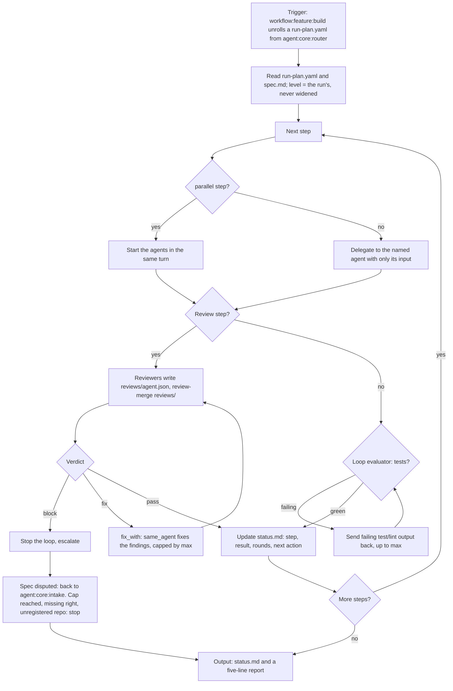

# `adorno-run-plan`

```mermaid
flowchart TD
  T["Trigger: workflow:feature:build unrolls a run-plan.yaml from agent:core:router"] --> RD["Read run-plan.yaml and spec.md; level = the run's, never widened"]
  RD --> ST["Next step"]
  ST --> P{"parallel step?"}
  P -->|"yes"| PA["Start the agents in the same turn"]
  P -->|"no"| SA["Delegate to the named agent with only its input"]
  PA --> RV
  SA --> RV{"Review step?"}
  RV -->|"yes"| MG["Reviewers write reviews/agent.json, review-merge reviews/"]
  RV -->|"no"| LP{"Loop evaluator: tests?"}
  MG --> VD{"Verdict"}
  VD -->|"block"| ESC["Stop the loop, escalate"]
  VD -->|"fix"| FX["fix_with: same_agent fixes the findings, capped by max"]
  VD -->|"pass"| UP
  FX --> MG
  LP -->|"failing"| RT["Send failing test/lint output back, up to max"]
  RT --> LP
  LP -->|"green"| UP["Update status.md: step, result, rounds, next action"]
  ESC --> IN["Spec disputed: back to agent:core:intake. Cap reached, missing right, unregistered repo: stop"]
  UP --> MORE{"More steps?"}
  MORE -->|"yes"| ST
  MORE -->|"no"| OUT["Output: status.md and a five-line report"]
  IN --> OUT
```
