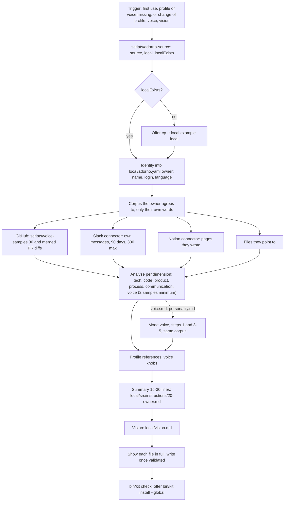
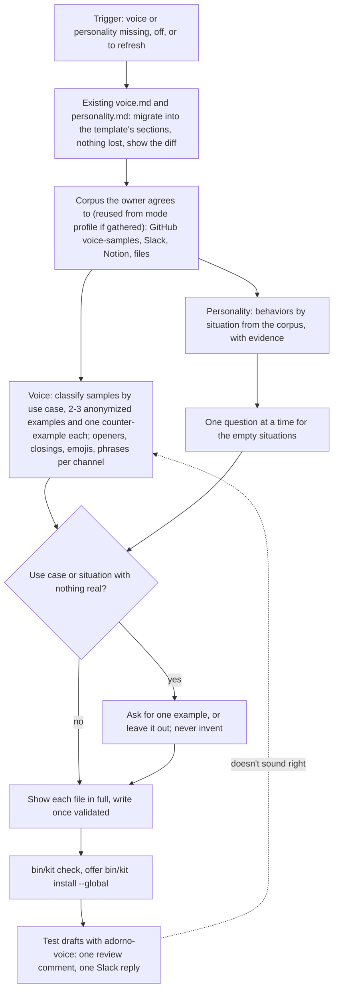
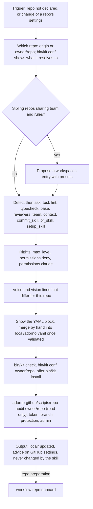

# `adorno-setup`

## Mode `profile`

```mermaid
flowchart TD
  T["Trigger: first use, profile or voice missing, or change of profile, voice, vision"] --> LO["scripts/adorno-source: source, local, localExists"]
  LO --> LE{"localExists?"}
  LE -->|"no"| CP["Offer cp -r local.example local"]
  LE -->|"yes"| ID
  CP --> ID["Identity into local/adorno.yaml owner: name, login, language"]
  ID --> CO["Corpus the owner agrees to, only their own words"]
  CO --> GH["GitHub: scripts/voice-samples 30 and merged PR diffs"]
  CO --> SK["Slack connector: own messages, 90 days, 300 max"]
  CO --> NT["Notion connector: pages they wrote"]
  CO --> FL["Files they point to"]
  GH --> AN["Analyse per dimension: tech, code, product, process, communication, voice (2 samples minimum)"]
  SK --> AN
  NT --> AN
  FL --> AN
  AN --> FI["Profile references, voice knobs"]
  AN -.->|"voice.md, personality.md"| MV["Mode voice, steps 1 and 3-5, same corpus"]
  MV --> FI
  FI --> SU["Summary 15-30 lines: local/src/instructions/20-owner.md"]
  SU --> VI["Vision: local/vision.md"]
  VI --> SH["Show each file in full, write once validated"]
  SH --> AP["bin/kit check, offer bin/kit install --global"]
```

## Mode `voice`

```mermaid
flowchart TD
  T["Trigger: voice or personality missing, off, or to refresh"] --> EX["Existing voice.md and personality.md: migrate into the template's sections, nothing lost, show the diff"]
  EX --> CO["Corpus the owner agrees to (reused from mode profile if gathered): GitHub voice-samples, Slack, Notion, files"]
  CO --> VO["Voice: classify samples by use case, 2-3 anonymized examples and one counter-example each; openers, closings, emojis, phrases per channel"]
  CO --> PE["Personality: behaviors by situation from the corpus, with evidence"]
  PE --> IQ["One question at a time for the empty situations"]
  VO --> GA{"Use case or situation with nothing real?"}
  IQ --> GA
  GA -->|"yes"| AK["Ask for one example, or leave it out; never invent"]
  GA -->|"no"| SH
  AK --> SH["Show each file in full, write once validated"]
  SH --> AP["bin/kit check, offer bin/kit install --global"]
  AP --> TR["Test drafts with adorno-voice: one review comment, one Slack reply"]
  TR -.->|"doesn't sound right"| VO
```

## Mode `repo`

```mermaid
flowchart TD
  T["Trigger: repo not declared, or change of a repo's settings"] --> WH["Which repo: origin or owner/repo; bin/kit conf shows what it resolves to"]
  WH --> WS{"Sibling repos sharing team and rules?"}
  WS -->|"yes"| WK["Propose a workspaces entry with presets"]
  WS -->|"no"| DT
  WK --> DT["Detect then ask: test, lint, typecheck, base, reviewers, team, context, commit_skill, pr_skill, setup_skill"]
  DT --> RG["Rights: max_level, permissions.deny, permissions.claude"]
  RG --> VO["Voice and vision lines that differ for this repo"]
  VO --> SH["Show the YAML block, merge by hand into local/adorno.yaml once validated"]
  SH --> AP["bin/kit check, bin/kit conf owner/repo, offer bin/kit install"]
  AP --> AU["adorno-github/scripts/repo-audit owner/repo (read only): token, branch protection, admin"]
  AU --> OUT["Output: local/ updated, advice on GitHub settings, never changed by the skill"]
  OUT -.->|"repo preparation"| ON["workflow:repo:onboard"]
```
