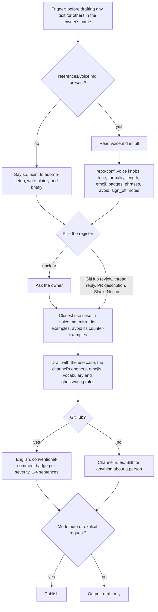

# `adorno-voice`

```mermaid
flowchart TD
  T["Trigger: before drafting any text for others in the owner's name"] --> V{"references/voice.md present?"}
  V -->|"no"| NV["Say so, point to adorno-setup, write plainly and briefly"]
  V -->|"yes"| RV["Read voice.md in full"]
  RV --> KN["repo-conf .voice knobs: tone, formality, length, emoji, badges, phrases, avoid, sign_off, notes"]
  NV --> REG
  KN --> REG{"Pick the register"}
  REG -->|"unclear"| ASK["Ask the owner"]
  ASK --> UC
  REG -->|"GitHub review, thread reply, PR description, Slack, Notion"| UC["Closest use case in voice.md: mirror its examples, avoid its counter-examples"]
  UC --> DR["Draft with the use case, the channel's openers, emojis, vocabulary and ghostwriting rules"]
  DR --> GH{"GitHub?"}
  GH -->|"yes"| BG["English, conventional-comment badge per severity, 1-4 sentences"]
  GH -->|"no"| CH["Channel rules, SBI for anything about a person"]
  BG --> PUB{"Mode auto or explicit request?"}
  CH --> PUB
  PUB -->|"yes"| SEND["Publish"]
  PUB -->|"no"| DF["Output: draft only"]
```
