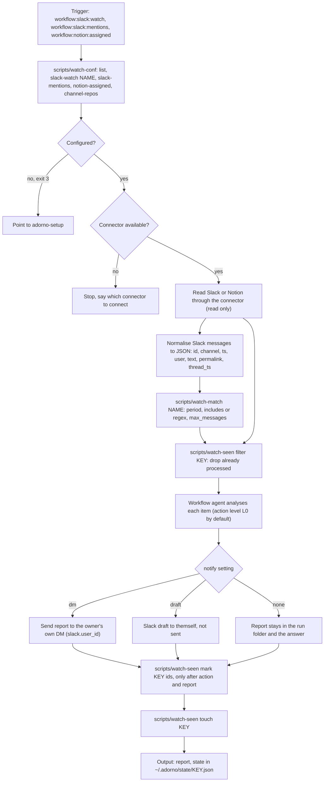

# `adorno-watch`

```mermaid
flowchart TD
  T["Trigger: workflow:slack:watch, workflow:slack:mentions, workflow:notion:assigned"] --> CF["scripts/watch-conf: list, slack-watch NAME, slack-mentions, notion-assigned, channel-repos"]
  CF --> NC{"Configured?"}
  NC -->|"no, exit 3"| SU["Point to adorno-setup"]
  NC -->|"yes"| CN{"Connector available?"}
  CN -->|"no"| STOP["Stop, say which connector to connect"]
  CN -->|"yes"| RD["Read Slack or Notion through the connector (read only)"]
  RD --> NM["Normalise Slack messages to JSON: id, channel, ts, user, text, permalink, thread_ts"]
  NM --> WM["scripts/watch-match NAME: period, includes or regex, max_messages"]
  WM --> SF["scripts/watch-seen filter KEY: drop already processed"]
  RD --> SF
  SF --> AG["Workflow agent analyses each item (action level L0 by default)"]
  AG --> NT{"notify setting"}
  NT -->|"dm"| DM["Send report to the owner's own DM (slack.user_id)"]
  NT -->|"draft"| DF["Slack draft to themself, not sent"]
  NT -->|"none"| KP["Report stays in the run folder and the answer"]
  DM --> MK["scripts/watch-seen mark KEY ids, only after action and report"]
  DF --> MK
  KP --> MK
  MK --> TC["scripts/watch-seen touch KEY"]
  TC --> OUT["Output: report, state in ~/.adorno/state/KEY.json"]
```
