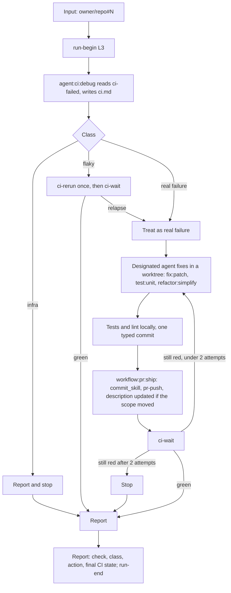

# `workflow:ci:*`

## workflow:ci:red

```mermaid
flowchart TD
  A["Input: owner/repo#N"] --> B["run-begin L3"]
  B --> C["agent:ci:debug reads ci-failed, writes ci.md"]
  C --> D{"Class"}
  D -->|"infra"| E["Report and stop"]
  D -->|"flaky"| F["ci-rerun once, then ci-wait"]
  F -->|"green"| K["Report"]
  F -->|"relapse"| G["Treat as real failure"]
  D -->|"real failure"| G
  G --> H["Designated agent fixes in a worktree: fix:patch, test:unit, refactor:simplify"]
  H --> I["Tests and lint locally, one typed commit"]
  I --> J["workflow:pr:ship: commit_skill, pr-push, description updated if the scope moved"]
  J --> L["ci-wait"]
  L -->|"still red, under 2 attempts"| H
  L -->|"still red after 2 attempts"| M["Stop"]
  L -->|"green"| K
  E --> K
  M --> K
  K --> N["Report: check, class, action, final CI state; run-end"]
```
