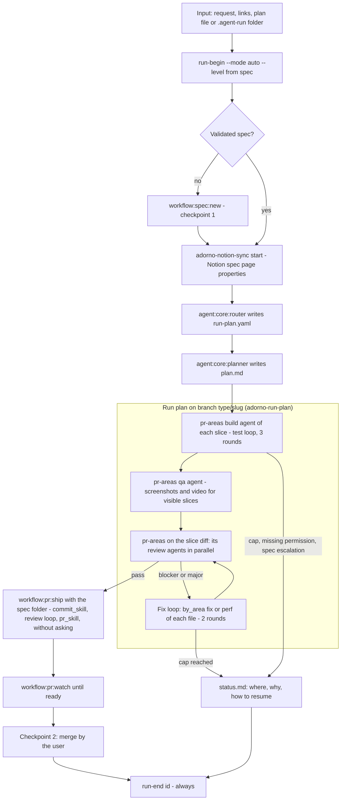
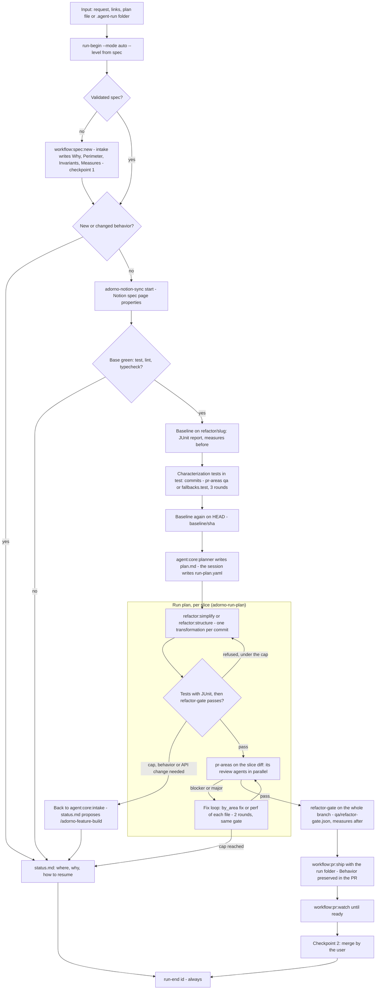

# `workflow:feature:*`

## `workflow:feature:build`

```mermaid
flowchart TD
  IN["Input: request, links, plan file or .agent-run folder"]
  RB["run-begin --mode auto --level from spec"]
  SPEC{"Validated spec?"}
  SN["workflow:spec:new - checkpoint 1"]
  NS["adorno-notion-sync start - Notion spec page properties"]
  RT["agent:core:router writes run-plan.yaml"]
  PL["agent:core:planner writes plan.md"]
  subgraph BUILD["Run plan on branch type/slug (adorno-run-plan)"]
    SL["pr-areas build agent of each slice - test loop, 3 rounds"]
    QA["pr-areas qa agent - screenshots and video for visible slices"]
    RV["pr-areas on the slice diff: its review agents in parallel"]
    FX["Fix loop: by_area fix or perf of each file - 2 rounds"]
  end
  PO["workflow:pr:ship with the spec folder - commit_skill, review loop, pr_skill, without asking"]
  PW["workflow:pr:watch until ready"]
  CP3["Checkpoint 2: merge by the user"]
  ST["status.md: where, why, how to resume"]
  RE["run-end id - always"]
  IN --> RB --> SPEC
  SPEC -->|"no"| SN --> NS
  SPEC -->|"yes"| NS
  NS --> RT
  RT --> PL --> SL --> QA --> RV
  RV -->|"blocker or major"| FX --> RV
  RV -->|"pass"| PO --> PW --> CP3 --> RE
  FX -->|"cap reached"| ST --> RE
  SL -->|"cap, missing permission, spec escalation"| ST
```

## `workflow:feature:refactor`

```mermaid
flowchart TD
  IN["Input: request, links, plan file or .agent-run folder"]
  RB["run-begin --mode auto --level from spec"]
  SPEC{"Validated spec?"}
  SN["workflow:spec:new - intake writes Why, Perimeter, Invariants, Measures - checkpoint 1"]
  BH{"New or changed behavior?"}
  NS["adorno-notion-sync start - Notion spec page properties"]
  BG{"Base green: test, lint, typecheck?"}
  BL["Baseline on refactor/slug: JUnit report, measures before"]
  CT["Characterization tests in test: commits - pr-areas qa or fallbacks.test, 3 rounds"]
  BS["Baseline again on HEAD - baseline/sha"]
  PL["agent:core:planner writes plan.md - the session writes run-plan.yaml"]
  subgraph SLICES["Run plan, per slice (adorno-run-plan)"]
    SL["refactor:simplify or refactor:structure - one transformation per commit"]
    GT{"Tests with JUnit, then refactor-gate passes?"}
    RV["pr-areas on the slice diff: its review agents in parallel"]
    FX["Fix loop: by_area fix or perf of each file - 2 rounds, same gate"]
  end
  FG["refactor-gate on the whole branch - qa/refactor-gate.json, measures after"]
  PO["workflow:pr:ship with the run folder - Behavior preserved in the PR"]
  PW["workflow:pr:watch until ready"]
  CP3["Checkpoint 2: merge by the user"]
  IT["Back to agent:core:intake - status.md proposes /adorno-feature-build"]
  ST["status.md: where, why, how to resume"]
  RE["run-end id - always"]
  IN --> RB --> SPEC
  SPEC -->|"no"| SN --> BH
  SPEC -->|"yes"| BH
  BH -->|"yes"| ST
  BH -->|"no"| NS --> BG
  BG -->|"no"| ST
  BG -->|"yes"| BL --> CT --> BS --> PL --> SL --> GT
  GT -->|"refused, under the cap"| SL
  GT -->|"cap, behavior or API change needed"| IT --> ST
  GT -->|"pass"| RV
  RV -->|"blocker or major"| FX --> RV
  RV -->|"pass"| FG --> PO --> PW --> CP3 --> RE
  FX -->|"cap reached"| ST --> RE
```
