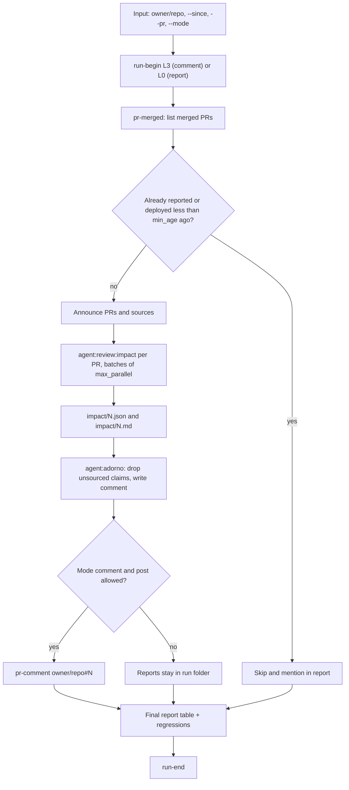
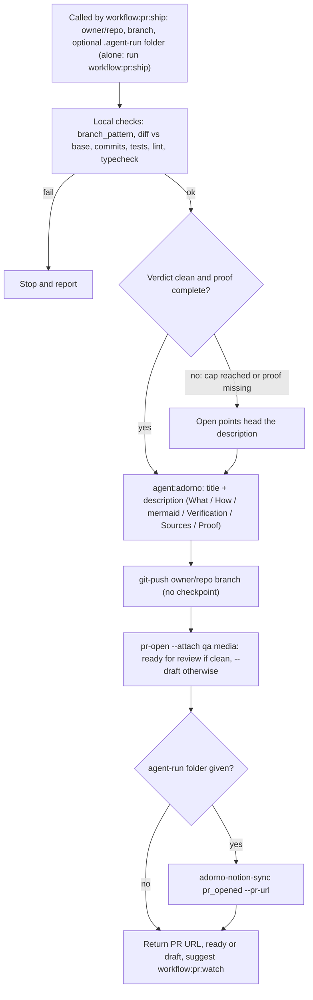
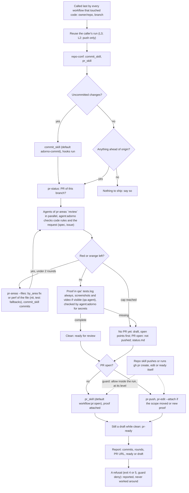
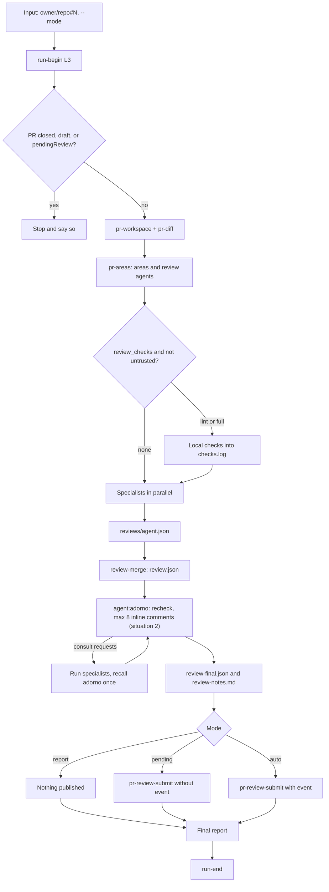
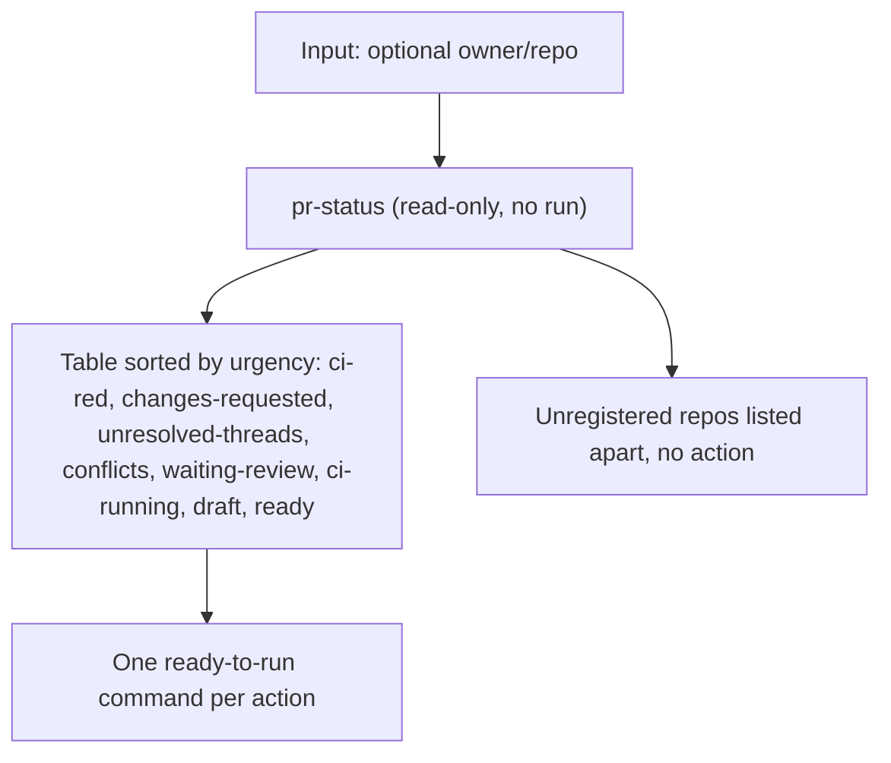
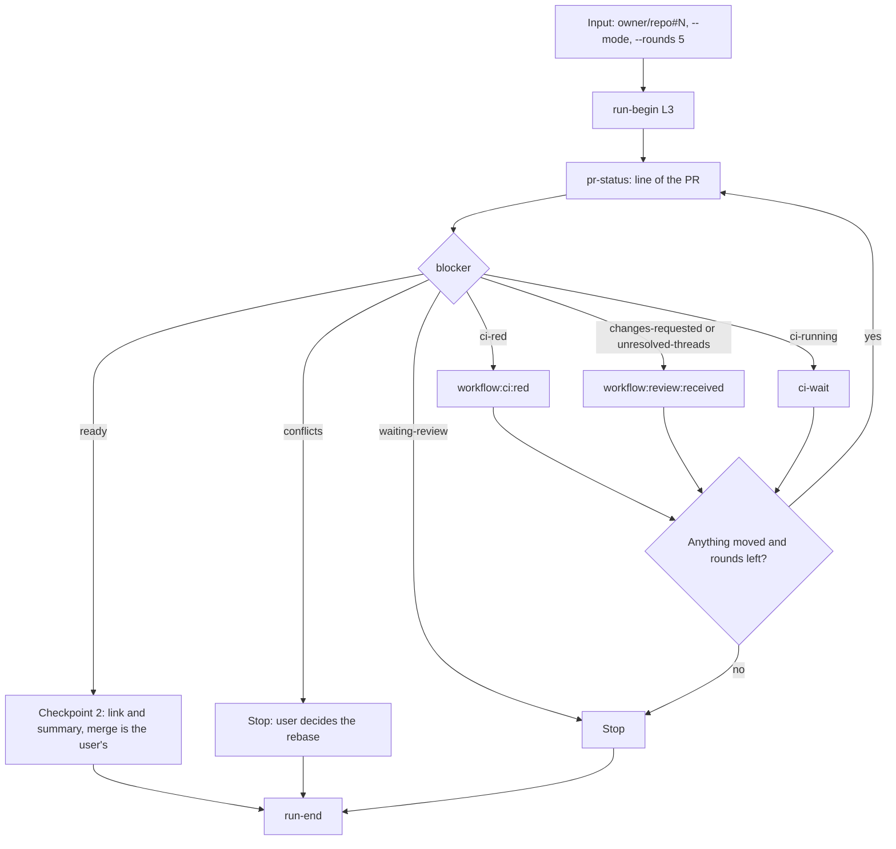

# `workflow:pr:*`

## workflow:pr:impact

```mermaid
flowchart TD
  A["Input: owner/repo, --since, --pr, --mode"] --> B["run-begin L3 (comment) or L0 (report)"]
  B --> C["pr-merged: list merged PRs"]
  C --> D{"Already reported or deployed less than min_age ago?"}
  D -->|"yes"| E["Skip and mention in report"]
  D -->|"no"| F["Announce PRs and sources"]
  F --> G["agent:review:impact per PR, batches of max_parallel"]
  G --> H["impact/N.json and impact/N.md"]
  H --> I["agent:adorno: drop unsourced claims, write comment"]
  I --> J{"Mode comment and post allowed?"}
  J -->|"yes"| K["pr-comment owner/repo#N"]
  J -->|"no"| L["Reports stay in run folder"]
  K --> M["Final report table + regressions"]
  L --> M
  E --> M
  M --> N["run-end"]
```

## workflow:pr:open

```mermaid
flowchart TD
  A["Called by workflow:pr:ship: owner/repo, branch, optional .agent-run folder (alone: run workflow:pr:ship)"] --> C["Local checks: branch_pattern, diff vs base, commits, tests, lint, typecheck"]
  C -->|"fail"| X["Stop and report"]
  C -->|"ok"| G{"Verdict clean and proof complete?"}
  G -->|"yes"| H["agent:adorno: title + description (What / How / mermaid / Verification / Sources / Proof)"]
  G -->|"no: cap reached or proof missing"| GH["Open points head the description"]
  GH --> H
  H --> K["git-push owner/repo branch (no checkpoint)"]
  K --> L["pr-open --attach qa media: ready for review if clean, --draft otherwise"]
  L --> NS{"agent-run folder given?"}
  NS -->|"yes"| NP["adorno-notion-sync pr_opened --pr-url"]
  NS -->|"no"| M["Return PR URL, ready or draft, suggest workflow:pr:watch"]
  NP --> M
```

## workflow:pr:ship

```mermaid
flowchart TD
  A["Called last by every workflow that touched code: owner/repo, branch"] --> B["Reuse the caller's run (L3; L2: push only)"]
  B --> C["repo-conf: commit_skill, pr_skill"]
  C --> D{"Uncommitted changes?"}
  D -->|"yes"| E["commit_skill (default adorno-commit), hooks run"]
  D -->|"no"| F{"Anything ahead of origin?"}
  E --> G["pr-status: PR of this branch?"]
  F -->|"no"| X["Nothing to ship: say so"]
  F -->|"yes"| G
  G --> R["Agents of pr-areas `review` in parallel, agent:adorno checks code rules and the request (spec, issue)"]
  R --> V{"Red or orange left?"}
  V -->|"yes, under 2 rounds"| FX["pr-areas --files: by_area fix or perf of the file (nit, test: fallbacks), commit_skill commits"]
  FX --> R
  V -->|"no"| PF["Proof in qa/: tests.log always, screenshots and video if visible (qa agent), checked by agent:adorno for secrets"]
  V -->|"cap reached"| DR["No PR yet: draft, open points first; PR open: not pushed; status.md"]
  PF -->|"complete"| OK["Clean: ready for review"]
  PF -->|"missing"| DR
  OK --> P{"PR open?"}
  DR --> P
  P -->|"no"| H["pr_skill (default workflow:pr:open), proof attached"]
  P -->|"yes"| I["pr-push, pr-edit --attach if the scope moved or new proof"]
  H --> RD["Still a draft while clean: pr-ready"]
  I --> RD
  RD --> J["Report: commits, rounds, PR URL, ready or draft"]
  K["Repo skill pushes or runs gh pr create, edit or ready itself"] -.->|"guard: allow inside the run, at its level"| H
  K -.-> I
  J --> L["A refusal (exit 4 or 5, guard deny): reported, never worked around"]
```

## workflow:pr:review

```mermaid
flowchart TD
  A["Input: owner/repo#N, --mode"] --> B["run-begin L3"]
  B --> C{"PR closed, draft, or pendingReview?"}
  C -->|"yes"| X["Stop and say so"]
  C -->|"no"| D["pr-workspace + pr-diff"]
  D --> E["pr-areas: areas and review agents"]
  E --> F{"review_checks and not untrusted?"}
  F -->|"lint or full"| G["Local checks into checks.log"]
  F -->|"none"| H["Specialists in parallel"]
  G --> H
  H --> I["reviews/agent.json"]
  I --> J["review-merge: review.json"]
  J --> K["agent:adorno: recheck, max 8 inline comments (situation 2)"]
  K -->|"consult requests"| L["Run specialists, recall adorno once"]
  L --> K
  K --> M["review-final.json and review-notes.md"]
  M --> N{"Mode"}
  N -->|"report"| O["Nothing published"]
  N -->|"pending"| P["pr-review-submit without event"]
  N -->|"auto"| Q["pr-review-submit with event"]
  O --> R["Final report"]
  P --> R
  Q --> R
  R --> S["run-end"]
```

## workflow:pr:status

```mermaid
flowchart TD
  A["Input: optional owner/repo"] --> B["pr-status (read-only, no run)"]
  B --> C["Table sorted by urgency: ci-red, changes-requested, unresolved-threads, conflicts, waiting-review, ci-running, draft, ready"]
  C --> D["One ready-to-run command per action"]
  B --> E["Unregistered repos listed apart, no action"]
```

## workflow:pr:watch

```mermaid
flowchart TD
  A["Input: owner/repo#N, --mode, --rounds 5"] --> B["run-begin L3"]
  B --> C["pr-status: line of the PR"]
  C --> D{"blocker"}
  D -->|"ci-red"| E["workflow:ci:red"]
  D -->|"changes-requested or unresolved-threads"| F["workflow:review:received"]
  D -->|"ci-running"| G["ci-wait"]
  D -->|"conflicts"| X["Stop: user decides the rebase"]
  D -->|"waiting-review"| Y["Stop"]
  D -->|"ready"| Z["Checkpoint 2: link and summary, merge is the user's"]
  E --> H{"Anything moved and rounds left?"}
  F --> H
  G --> H
  H -->|"yes"| C
  H -->|"no"| Y
  Z --> W["run-end"]
  X --> W
  Y --> W
```
