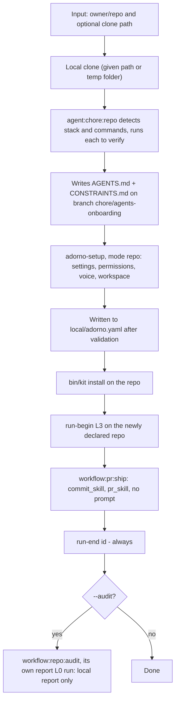
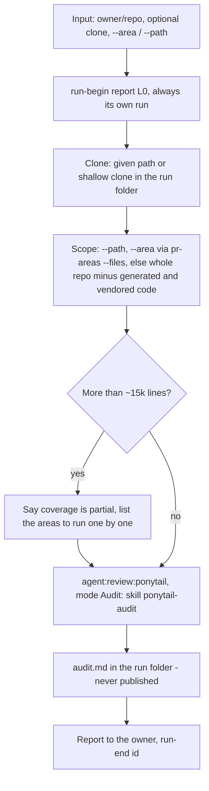

# `workflow:repo:*`

## `workflow:repo:onboard`

```mermaid
flowchart TD
  IN["Input: owner/repo and optional clone path"]
  CL["Local clone (given path or temp folder)"]
  AG["agent:chore:repo detects stack and commands, runs each to verify"]
  BR["Writes AGENTS.md + CONSTRAINTS.md on branch chore/agents-onboarding"]
  SU["adorno-setup, mode repo: settings, permissions, voice, workspace"]
  LY["Written to local/adorno.yaml after validation"]
  KI["bin/kit install on the repo"]
  RB["run-begin L3 on the newly declared repo"]
  SH["workflow:pr:ship: commit_skill, pr_skill, no prompt"]
  AU{"--audit?"}
  RE["run-end id - always"]
  RA["workflow:repo:audit, its own report L0 run: local report only"]
  DONE["Done"]
  IN --> CL --> AG --> BR --> SU --> LY --> KI --> RB --> SH --> RE --> AU
  AU -->|yes| RA
  AU -->|no| DONE
```

## `workflow:repo:audit`

```mermaid
flowchart TD
  IN["Input: owner/repo, optional clone, --area / --path"]
  RB["run-begin report L0, always its own run"]
  CL["Clone: given path or shallow clone in the run folder"]
  SC["Scope: --path, --area via pr-areas --files, else whole repo minus generated and vendored code"]
  BIG{"More than ~15k lines?"}
  WARN["Say coverage is partial, list the areas to run one by one"]
  AG["agent:review:ponytail, mode Audit: skill ponytail-audit"]
  OUT["audit.md in the run folder - never published"]
  RE["Report to the owner, run-end id"]
  IN --> RB --> CL --> SC --> BIG
  BIG -->|yes| WARN --> AG
  BIG -->|no| AG
  AG --> OUT --> RE
```
