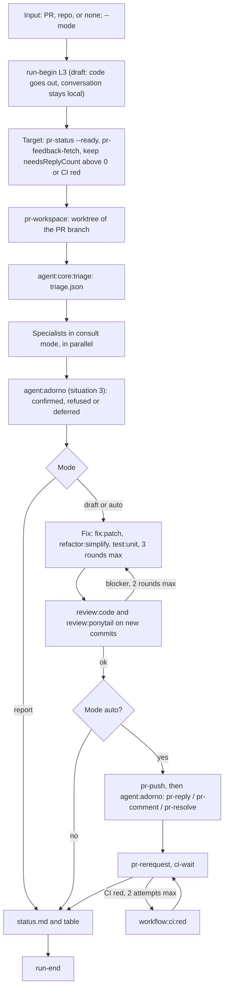
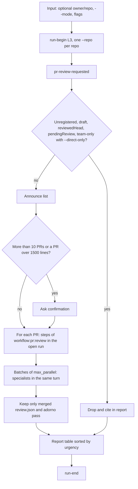

# `workflow:review:*`

## workflow:review:received

```mermaid
flowchart TD
  A["Input: PR, repo, or none; --mode"] --> B["run-begin L3 (draft: code goes out, conversation stays local)"]
  B --> C["Target: pr-status --ready, pr-feedback-fetch, keep needsReplyCount above 0 or CI red"]
  C --> D["pr-workspace: worktree of the PR branch"]
  D --> E["agent:core:triage: triage.json"]
  E --> F["Specialists in consult mode, in parallel"]
  F --> G["agent:adorno (situation 3): confirmed, refused or deferred"]
  G --> H{"Mode"}
  H -->|"report"| N["status.md and table"]
  H -->|"draft or auto"| I["Fix: fix:patch, refactor:simplify, test:unit, 3 rounds max"]
  I --> J["review:code and review:ponytail on new commits"]
  J -->|"blocker, 2 rounds max"| I
  J -->|"ok"| K{"Mode auto?"}
  K -->|"no"| N
  K -->|"yes"| L["pr-push, then agent:adorno: pr-reply / pr-comment / pr-resolve"]
  L --> M["pr-rerequest, ci-wait"]
  M -->|"CI red, 2 attempts max"| R["workflow:ci:red"]
  R --> M
  M --> N
  N --> O["run-end"]
```

## workflow:review:requested

```mermaid
flowchart TD
  A["Input: optional owner/repo, --mode, flags"] --> B["run-begin L3, one --repo per repo"]
  B --> C["pr-review-requested"]
  C --> D{"Unregistered, draft, reviewedHead, pendingReview, team-only with --direct-only?"}
  D -->|"yes"| E["Drop and cite in report"]
  D -->|"no"| F["Announce list"]
  F --> G{"More than 10 PRs or a PR over 1500 lines?"}
  G -->|"yes"| H["Ask confirmation"]
  G -->|"no"| I["For each PR: steps of workflow:pr:review in the open run"]
  H --> I
  I --> J["Batches of max_parallel: specialists in the same turn"]
  J --> K["Keep only merged review.json and adorno pass"]
  K --> L["Report table sorted by urgency"]
  E --> L
  L --> M["run-end"]
```
