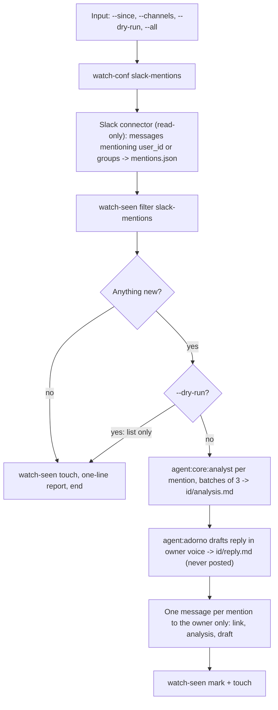
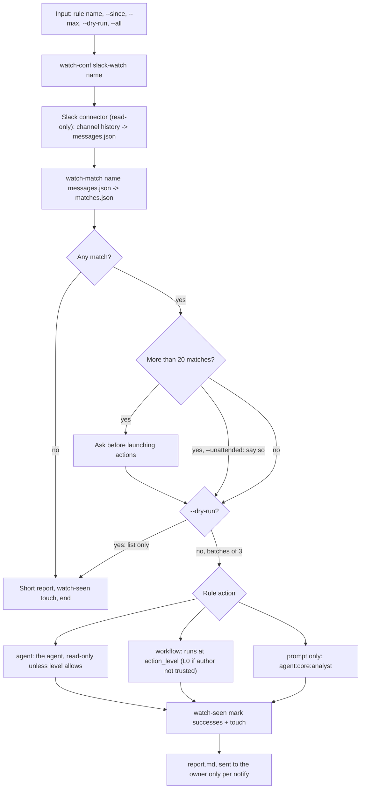

# `workflow:slack:*`

## `workflow:slack:mentions`

```mermaid
flowchart TD
  IN["Input: --since, --channels, --dry-run, --all"]
  CF["watch-conf slack-mentions"]
  SE["Slack connector (read-only): messages mentioning user_id or groups -> mentions.json"]
  FL["watch-seen filter slack-mentions"]
  EM{"Anything new?"}
  TC["watch-seen touch, one-line report, end"]
  DRY{"--dry-run?"}
  AN["agent:core:analyst per mention, batches of 3 -> id/analysis.md"]
  RP["agent:adorno drafts reply in owner voice -> id/reply.md (never posted)"]
  SD["One message per mention to the owner only: link, analysis, draft"]
  MK["watch-seen mark + touch"]
  IN --> CF --> SE --> FL --> EM
  EM -->|"no"| TC
  EM -->|"yes"| DRY
  DRY -->|"yes: list only"| TC
  DRY -->|"no"| AN --> RP --> SD --> MK
```

## `workflow:slack:watch`

```mermaid
flowchart TD
  IN["Input: rule name, --since, --max, --dry-run, --all"]
  CF["watch-conf slack-watch name"]
  RD["Slack connector (read-only): channel history -> messages.json"]
  MT["watch-match name messages.json -> matches.json"]
  EM{"Any match?"}
  TC["Short report, watch-seen touch, end"]
  BIG{"More than 20 matches?"}
  ASK["Ask before launching actions"]
  DRY{"--dry-run?"}
  ACT{"Rule action"}
  AG["agent: the agent, read-only unless level allows"]
  WF["workflow: runs at action_level (L0 if author not trusted)"]
  PM["prompt only: agent:core:analyst"]
  MK["watch-seen mark successes + touch"]
  RP["report.md, sent to the owner only per notify"]
  IN --> CF --> RD --> MT --> EM
  EM -->|"no"| TC
  EM -->|"yes"| BIG
  BIG -->|"yes"| ASK --> DRY
  BIG -->|"yes, --unattended: say so"| DRY
  BIG -->|"no"| DRY
  DRY -->|"yes: list only"| TC
  DRY -->|"no, batches of 3"| ACT
  ACT --> AG --> MK
  ACT --> WF --> MK
  ACT --> PM --> MK
  MK --> RP
```
